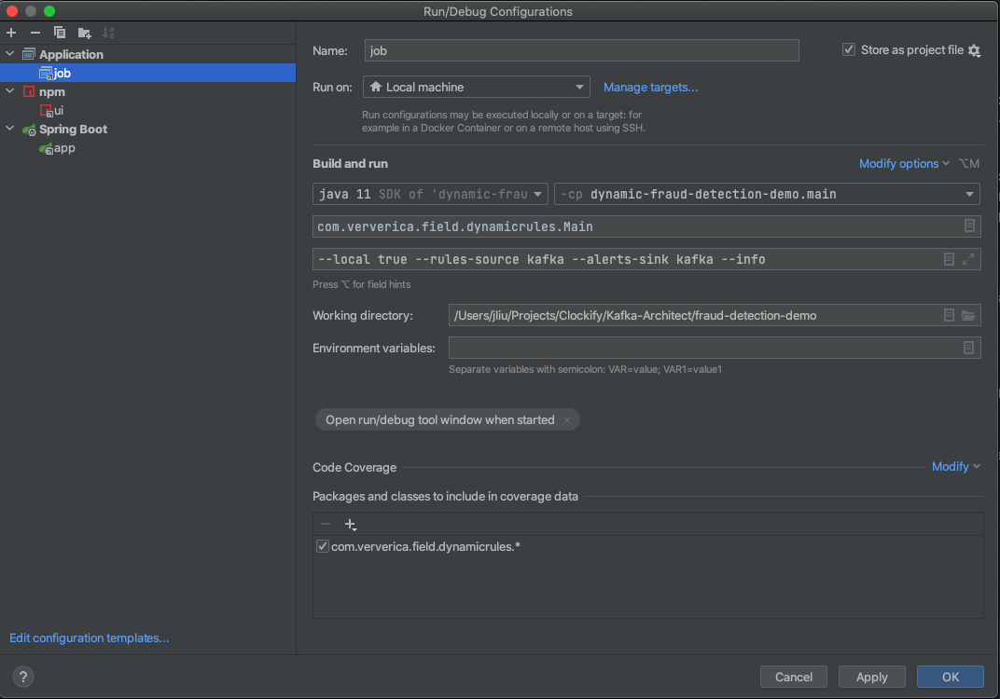

## A Sample Project (fraud detection) for studying Kafka and Flink 

### My Goals

**The sample code I copied/modified based on [afedulov/fraud-detection-demo](https://github.com/afedulov/fraud-detection-demo).** 

 - run/debug with intellij idea.
 - understand pros and cons between flink streaming and (spark streaming & kafka streaming).
 - help me to understand flink infrastructure and design idea.

### How to Run/Debug with Intellij Idea

As described in `My Goals`, it's critical to have a local runnable environment to reach my goals.

1. git clone git@github.com:suwkong/fraud-detection-demo.git. 
2. docker-compose run -f docker-compose.yaml.
3. open project with intellij idea.
   - add jdk 11.
   - run `npm install` under `webapp/` to install ui dependencies.
4. switch to `.run`, and open 3 pre-saved debug/run configurations.
5. start job/app/ui with debug/run tool.

**NOTE**, After following step #3, the run/debug configuration will look like this:

